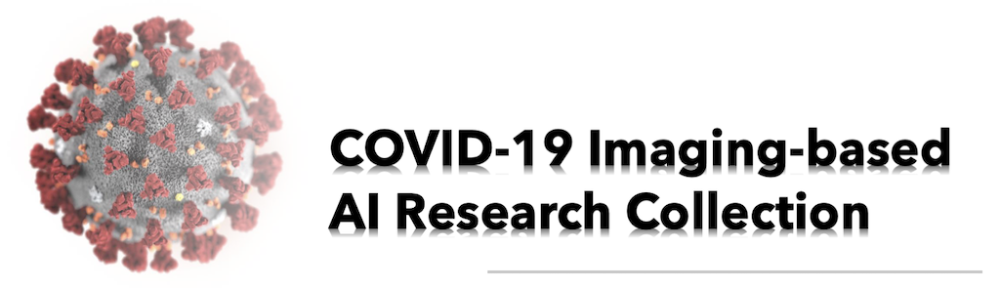

# nCoVSegNet
COVID-19 Lung Infection Segmentation with A Novel Two-Stage Cross-Domain Transfer Learning Framework

<p align="center">
     <br />
</p>


## Requirements

- Python3
- Pytorch version >= 1.2.0.
- Some basic python packages, such as Numpy, Pandas, SimpleITK.

## Data Preparation

- Please put CT images and segmentation masks in the following directory: `./dataset/`, and organize the data as follows:
  ``` 
     ├── dataset
        ├── train
           ├── image
               ├── 1.jpg, 2.jpg, xxxx
           ├── mask
               ├── 1.png, 2.png, xxxx
        ├── test
           ├── image
               ├── case01
                   ├── 1.jpg, 2.jpg, xxxx
               ├── xxxx
           ├── mask
               ├── case01
                   ├── 1.png, 2.png, xxxx
               ├── xxxx
  ```

## Training & Testing

- Train the nCoVSegNet:

  `python train.py`

- Test the nCoVSegNet:

  `python test.py`

  The results will be saved to `./Results`.

- Evaluate the segmentation maps:

  You can evaluate the segmentation maps using the tool in `./utils/evaluation.py`.

## Citation

Please cite the following paper if you use this repository in your reseach.

```
@article{liu2021covid19,
title={COVID-19 Lung Infection Segmentation with A Novel Two-Stage Cross-Domain Transfer Learning Framework},
author={Jiannan Liu, Bo Dong, Shuai Wang, Hui Cui, Dengping Fan, Jiquan Ma, Geng Chen},
booktitle={Medical Image Analysis},
year={2021}
}
```
## Acknowledgement

A collection of COVID-19 imaging-based AI research papers and datasets: https://github.com/HzFu/COVID19_imaging_AI_paper_list

<p align="center">
     <br />
</p>

# License

Our code is released under MIT License (see LICENSE file for details).

